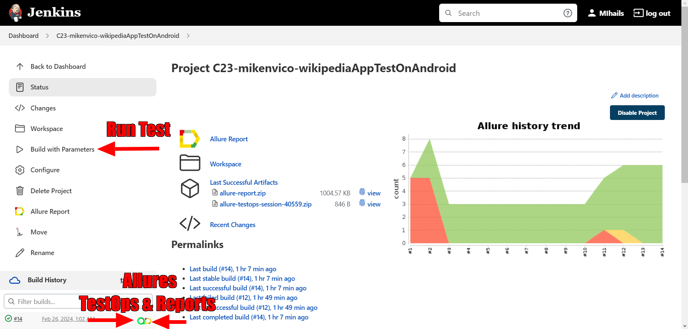
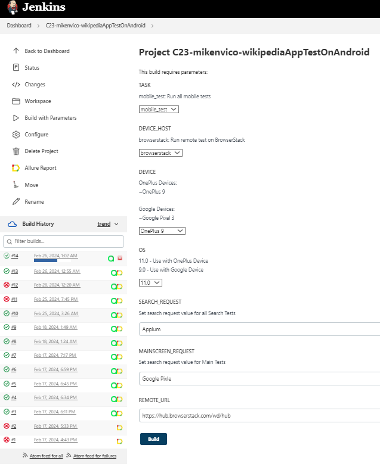
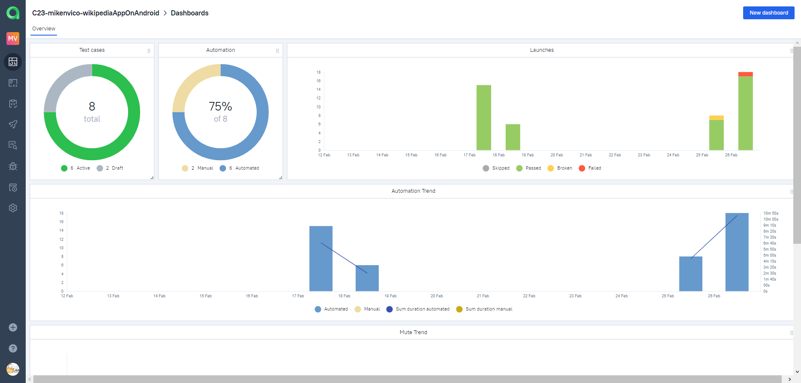
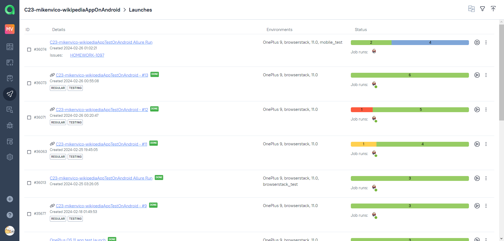
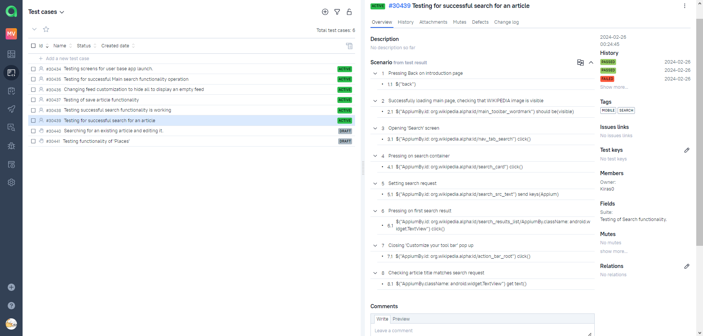
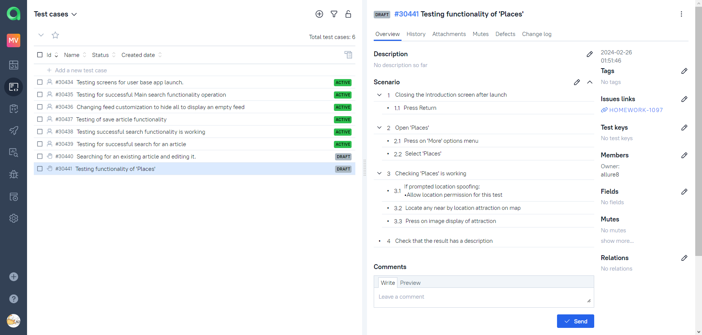
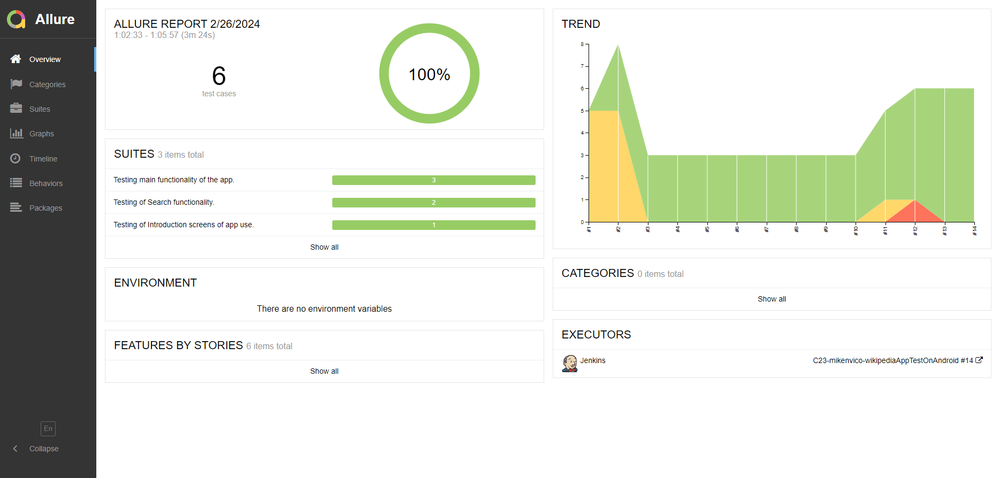
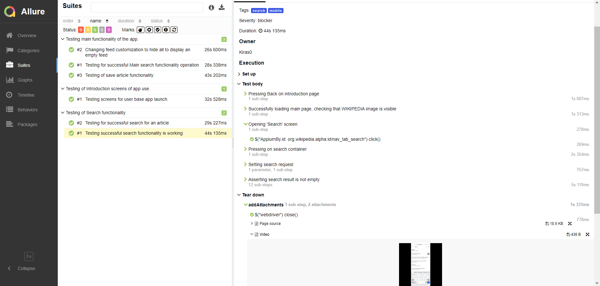
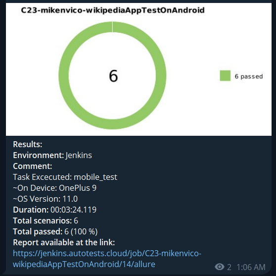
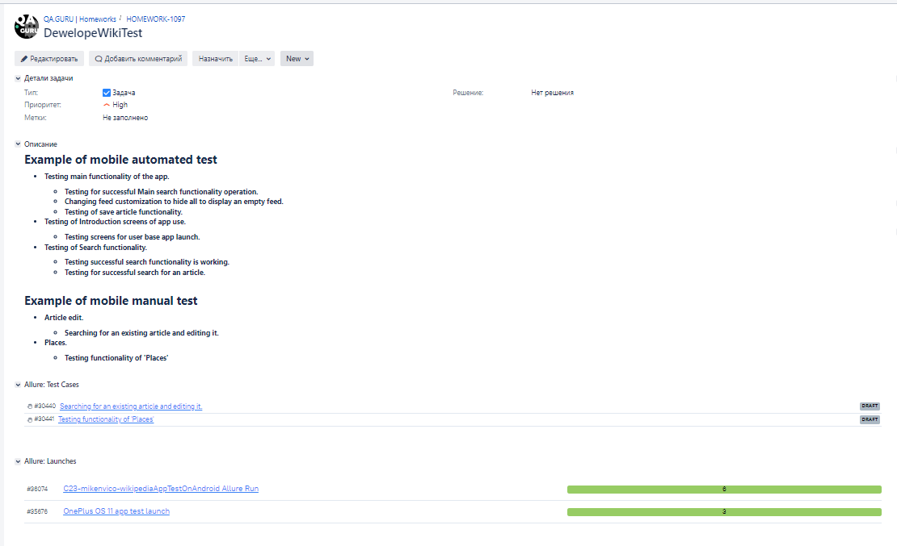

# <p align="center">Mobile automation project for Wikipedia App</p>

<p align="center" ><a href="https://www.visitacity.com">

</a></p>

## :link: Contents
- [Tools and Istruments](#wrench-tools-and-instruments)
- [How to run the automated tests](#bookmark_tabs-test-cases)
- - [Local Emulator](#computer-local-emulator)
- - [Remote](#satellite-remote)
- [Allure TestOps](#img-width3-titleallure-testops-srcmediaimagesallure-testops-logosvg-allure-testops-integration)
- [Allure Reports](#img-width3-titleallure-reports-srcmediaimagesallure-report-logosvg-allure-reports-integration)
- [Test Results](#ledger-test-results)
- - [Report](#example-of-a-test-run-report)
- - [Video](#img-width3-titleselenoid-srcmediaimagesselenoid-logosvg-video-of-the-test)
- - [Telegram](#img-width3-titletelegram-srcmediaimagestelegram-logosvg-telegram-test-result-notification)
- [Jira](#img-width4-titlejira-srcmediaimagesjira-logosvg-jira-integration)


## 	:wrench: Tools and Instruments

<p  align="center">
  <code></code>
  <code></code>
  <code></code>
  <code></code>
  <code></code>
  <code></code>
  <code></code>
  <code></code>
  <code></code>
  <code></code>
  <code></code>
  <code></code>
</p>

- **Java** is the primary programming language for this project.
- **Selenide** and **Appium** frameworks are used for writing the automated tests.
- **JUnit 5** is used as a unit testing framework.
- **Gradle** is used to build the project.
- **Android Studio** is used to create a local emulator device.
- **Jenkins** is used for running the tests.
- **Browserstack** is used to launch tests on remote devices.
- **Allure Report** is used to visualize test results.
- **Telegram API** is used for receiving the final report via Telegram Bot.

# :bookmark_tabs: Test Cases

## :desktop_computer: Automated Tests

- Testing for successful Main search functionality operation.
- - Changing feed customization to hide all to display an empty feed.
- - Testing of save article functionality.
- Testing of Introduction screens of app use.
- - Testing screens for user base app launch.
- Testing of Search functionality.
- - Testing successful search functionality is working.
- - Testing for successful search for an article.

## :hand: Manual Test

- Article edit testing.
- - Searching for an existing article and editing it.
- Tests for Places .
- - Testing functionality of 'Places'

# :gear: How to run the automated tests

## :computer: Local Emulator

### :iphone: Local Emulator Test Run

To run the automated tests on local emulator:

```bash
gradle clean test -DdeviceHost=local
```

***Note: Preconditions required!!!***\
To run the automated tests locally on emulator some preconditions for this method are required:
- Appium GUI is installed
- Android Studio is installed (with Virtual Device Manager available)
- The following device is added:
- _Device name: **Pixel 3 API 34**_
- _Platform version: **14.0**_
- Appium server is running: <code>appium server</code>
- The AVD is running in the emulator

### Local BrowserStack Test Run

To run the automated tests on BrowserStack:

```bash
gradle clean test -DdeviceHost=local 
```

## :satellite: Remote

###  Using [Jenkins](https://jenkins.autotests.cloud/job/C23-mikenvico-wikipediaAppTestOnAndroid/)

To run this test through Jenkins, press button :arrow_forward:<code>Build with Parameters</code>.\
You can see the results via Allure Reports, or use the link to Allure TestOps on the same page.
<p align="center">

</p>

###  Test Parameters
You can change the following parameters in the test:
- <code>TASK</code> - Test to be executed. Default:<code>mobile_test</code>
- <code>DEVICE_HOST</code> - Set device platform to execute tests on. Default:<code>browserstack</code>
- <code>DEVICE</code> - Set default device to run tests on.
- <code>OS</code> - Set defaults device OS version.
- <code>SEARCH_REQUEST</code> - Set default search value for **Search** tests.
- <code>MAINSEARCH_REQUEST</code> - Set default search value for **Main** tests.

<p align="center">

</p>

## [ Allure TestOps](https://allure.autotests.cloud/project/4046/dashboards) Integration

### Dashboard

<p align="center">

</p>

---

### Launches

 <p align="center">
 
 </p>

---


## :bookmark_tabs: Test Cases in TestOps

### Automated

> Example of Automated Test Cases

<p align="center">

</p>

---

### Manual

> Example of Manual Test Cases

<p align="center">

</p>


## [ Allure Reports](https://jenkins.autotests.cloud/job/C23-mikenvico-wikipediaAppTestOnAndroid/allure/) Integration


### Jenkins Allure Overview

<p align="center">

</p>


## :ledger: Test Results

---

### Example of a Test Run report

> Allure Reports Provides a detailed step by step report of each test, test tag and other data like test severity level.\
> With each test result there is attached material such as test executed steps, page source as well as a video.

<p align="center">

</p>

---

###  Video of the Test

> Example of a Test and how BrowserStack provides a video after each test.\
> Video of: Testing of save article functionality

<p align="center">

</p>

---

###  Telegram test result notification

> After tests are finished created Telegram Bot sends generated test result notification.

<p align="center">

</p>

---

##  Jira Integration

<p align="center">

</p>
